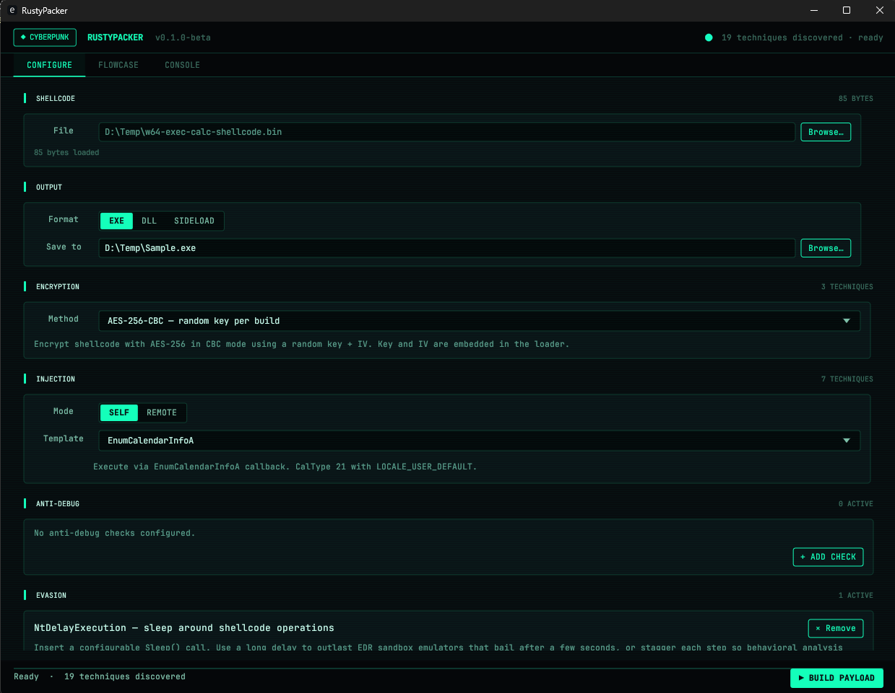
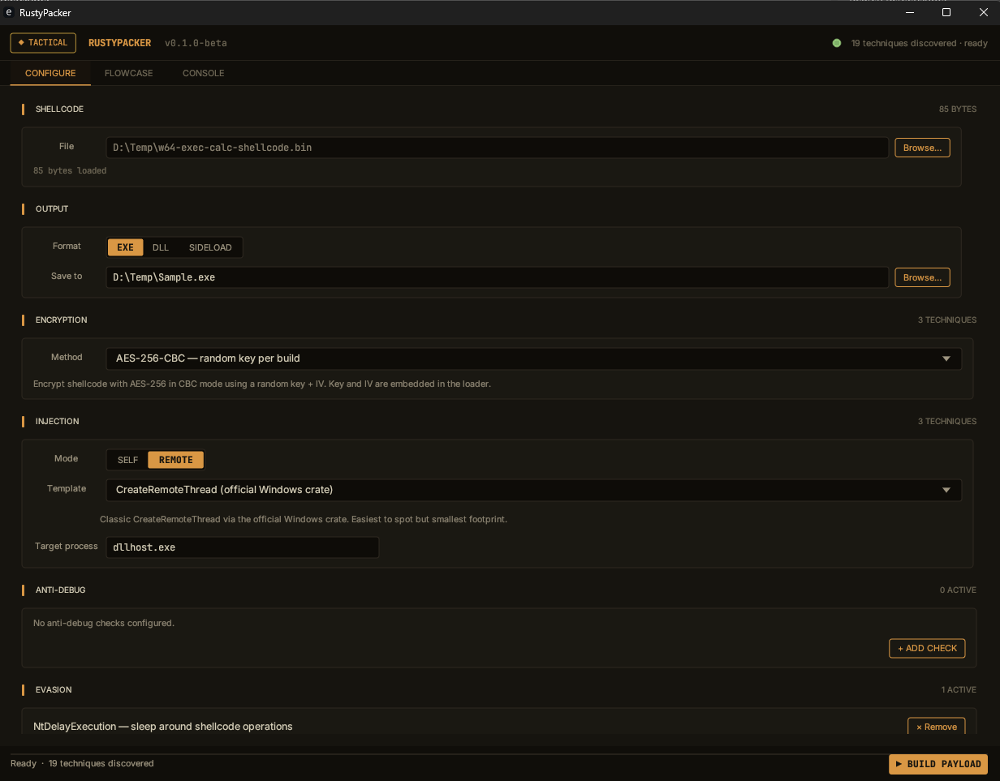

<div align="center">
  <br>
  
  <h1>RustyPacker</h1>
  <p><b>A native Rust shellcode packer with a GUI.</b></p>
  
  
  
  
</div>

<br>

RustyPacker comes in two themes:


<div align="center">
  
  
</div>

<br>

> Note: Rustypacker comes in beta version. If you want to help fixing bugs or to add your own technique, you can create issues or directly contribute to the repository...

## How Rustypacker works..

In Rustypacker you can do the following things. 

- encryption method (AES-256-CBC, XOR, UUID-encoded).
- Dual injection techniques. `SELF` or `REMOTE`.
- execution mode for the NT path (indirect syscall or call-stack spoofing via desync).
- Anti-debug checks.
- Evasion checks (sleep, domain pinning).
- Different output format. EXE, DLL, or DLL Sideload with optional Proxy mode and a `.def` for unhandled exports.

RustyPacker writes a fresh Rust project under `shared/output_<timestamp>/`, performs every placeholder substitution the chosen techniques request, and runs `cargo build --release --target x86_64-pc-windows-{msvc|gnu}` to produce the final binary alongside the generated source.


## Features

| Category   | Built-in techniques                                                                                              |
|------------|------------------------------------------------------------------------------------------------------------------|
| Encryption | AES-256-CBC, XOR, UUID                                                                                            |
| Injection (remote) | sysCRT, winCRT, EarlyCascade                                                                              |
| Injection (self)   | sysFIBER, EnumCalendarInfoA, EnumDesktopsW, EnumWindowStationsW, EnumSystemGeoID, CDefFolderMenu_Create2, RtlUserFiberStart |
| Anti-debug | CheckRemoteDebuggerPresent, NtQueryInformationProcess (ProcessDebugPort), TEB BeingDebugged, Vectored INT3 |
| Evasion    | NtDelayExecution sleep, domain pinning                                                                            |
| Exec mode  | Indirect syscall (default) or call-stack spoofing via desync (`spoof` crate, ntCRT/ntAPC/ntFIBER/EarlyCascade)     |
| Output     | EXE, DLL, DLL Sideload (Sideload or Proxy with absolute or relative path)                                         |

Other extras:

- Live FlowCase tab. Shows the execution path of the payload you are configuring.
- Inline DLL exports preview when picking a sideload target.
- Streaming Console. Streams `cargo` output line by line.
- Cyberpunk default theme. Switch to Tactical via the `◆` button in the top-left.

Every build picks a fresh random seed from the OS and drives every variable surface in the payload from it. Two builds with the same shellcode and the same options still produce different payloads.

---

## Build and Run

- Rust toolchain. `rustup` is enough. RustyPacker runs via `cargo run`.
- Windows host with MSVC, or any host with the MinGW-w64 toolchain plus `rustup target add x86_64-pc-windows-gnu`.

```pwsh
git clone https://git.smukx.site/smukx/RustyPacker.git
cd RustPacker
cargo run --release
```
---

## Outputs

A successful build will be :

```
shared/output_<unix-timestamp>/
├── Cargo.toml              # rendered from the chosen template
├── src/
│   ├── main.rs (or lib.rs) # rendered, with shellcode embedded
│   └── input.aes / .xor    # encrypted shellcode blob
└── target/
    └── x86_64-pc-windows-{msvc|gnu}/release/
        ├── <name>.exe
        └── <name>.dll
```

The full Rust project stays on disk for you to inspect, tweak, or rebuild manually.

---

## Running the payload


### DLL

DllMain is a NO-OP. The payload body lives in four exported functions, so the loader must call one of them. Pick whichever fits the host.

```pwsh
rundll32.exe payload.dll,Run
regsvr32.exe payload.dll                          # calls DllRegisterServer
regsvr32.exe /u payload.dll                       # calls DllUnregisterServer
rundll32.exe payload.dll,DllRegisterServer
```

Exported entrypoints: `Run`, `DllRegisterServer`, `DllGetClassObject`, `DllUnregisterServer`. COM hijacks ride `DllGetClassObject`. Keeping DllMain empty avoids loader-lock deadlocks and cuts EDR signal during DLL load.

### DLL Sideload (Sideload or Proxy)

The hijacked export from the target DLL becomes the entrypoint. Drop your DLL next to the host EXE and let the host load it. The payload fires when the host calls the hijacked export. Proxy mode forwards every other export to the original DLL via a generated `.def`, so the host keeps working without crashing.

For the full sideloading workflow, picking a target, and proxy generation, see [LazyDLLSideload](https://git.smukx.site/smukx/LazyDLLSideload).

---

## For developers 

Adding your own techniques [encryption, injection, anti-debug, or evasion] is a three file change (`technique.toml` plus `mod.rs` plus an optional template folder). `build.rs` discovers techniques by walking `src/techniques/`, so there is no registration boilerplate to edit.

If you want full guide, you can take an look at [development.md](./development.md). It covers architecture, manifest format, `BuildContext` API, placeholder catalogue, three worked examples, GUI integration notes, and common pitfalls.

---

## Project layout

```
src/
├── bin/gui.rs              # entry point
├── compiler.rs             # invokes cargo for the assembled project
├── puzzle.rs               # assembles the project from techniques + templates
├── order.rs                # the build order DTO
├── techniques/             # technique plugins (auto-discovered by build.rs)
│   ├── encryption/{aes,xor,uuid}/
│   ├── injection/{syscrt,sysfiber,wincrt,earlycascade,callback-based self-inject}/
│   └── evasion/{nt_delay,domain_pin,anti_debug_*}/
├── gui/
│   ├── mod.rs              # App, validation, top-level dispatch
│   ├── state.rs            # AppState, persisted via eframe::set_value
│   ├── theme.rs            # Tactical + Cyberpunk palettes
│   ├── widgets.rs          # ground-truth widget primitives
│   ├── tab_configure.rs    # Configure tab
│   ├── tab_flowcase.rs     # FlowCase tab
│   └── tab_console.rs      # Console tab
├── sideload.rs, pe_parser.rs, shellcode_reader.rs, tools.rs, build_log.rs
└── lib.rs
templates/                  # technique templates (Cargo + main.rs with placeholders)
build.rs                    # walks techniques/, emits registry.rs into OUT_DIR
```


## Recognition:

Every accepted contribution puts your handle in the Credits section and the release notes. Your name stays in the contributor list.

## Credits

- [Dyncvoke](https://git.smukx.site/smukx/Dyncvoke)
- [Rust-for-Malware-Development](https://git.smukx.site/smukx/Rust-for-Malware-Development)
- [LazyDLLSideload](https://git.smukx.site/smukx/LazyDLLSideload)

## Disclaimer

For authorised offensive security work, CTFs, malware research, and detection engineering only.
